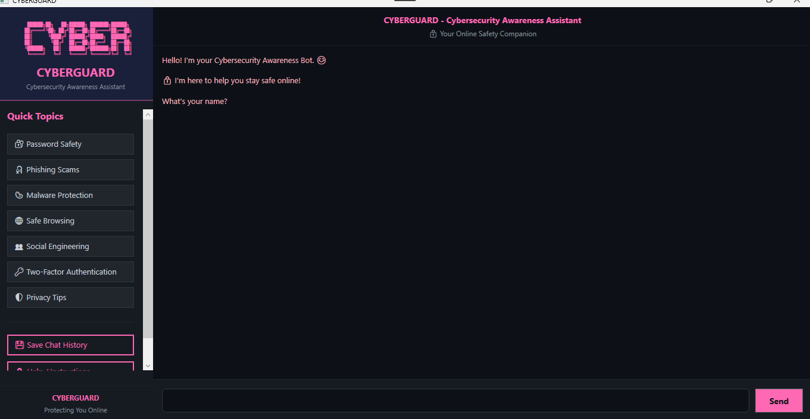
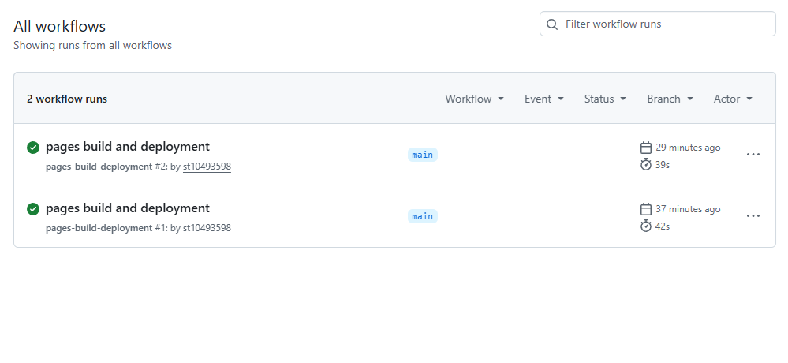

# 🛡️ CYBERGUARD - Cybersecurity Awareness Chatbot

A WPF-based interactive chatbot that educates users about cybersecurity through keyword recognition, sentiment detection, and personalized conversations.

**Author:** [MAKWINJA TUMELO]  
**Student Number:** ST10493598

---

## ✅ Features Implemented in Part 2

| Feature | Description |
|---------|-------------|
| 🎯 Keyword Recognition | Detects 7 cybersecurity topics (password, phishing, scam, privacy, browsing, malware, update) |
| 🎲 Random Responses | Each keyword has 4 different responses, randomly selected |
| 😊 Sentiment Detection | Detects worried, curious, frustrated, happy, neutral moods with empathetic openers |
| 🧠 Memory & Recall | Remembers user name and favourite cybersecurity topic |
| 💬 Conversation Flow | Handles "tell me more" follow-ups without resetting |
| 🎨 WPF GUI | Clean dark theme with CyberGuard branding, sidebar, chat area, and buttons |
| 🔊 Voice Greeting | Plays greeting.wav on startup |
| 🖼️ ASCII Art | Displays CYBER logo in sidebar |
| 💾 Save Chat History | Saves conversation to Desktop as .txt file |

---

## 📸 Screenshot of Running Application



---

## 📋 Prerequisites

- Windows 10 or 11
- Visual Studio 2022
- .NET 8.0 SDK

---

## 🚀 Step-by-Step Instructions to Clone and Run

### Step 1: Clone the Repository

```bash
git clone https://github.com/ST10493598/cybersecuritychatbot.git
```

### Step 2: Open the Project

Open Visual Studio 2022 and select:

```text
Open a project or solution
```

Navigate to the cloned folder and open:

```text
CybersecurityChatbotGUI.sln
```

### Step 3: Run the Application

Press:

```text
F5
```

or click:

```text
Start
```

to launch the CYBERGUARD chatbot application.

---

## 🧠 Cybersecurity Topics Supported

- Password Safety
- Phishing Attacks
- Online Scams
- Privacy Protection
- Safe Browsing
- Malware Awareness
- Software Updates

---

## 💾 Save Chat Feature

The chatbot allows users to save conversation history to a `.txt` file directly on the Desktop for future reference.

---

## 🛠️ Technologies Used

- C#
- WPF
- XAML
- .NET 8
- Visual Studio 2022

---

## 🤖 AI / Logic Used

This chatbot uses rule-based AI techniques:

- Keyword recognition (pattern matching)
- Sentiment detection (emotion detection)
- Memory storage for personalization
- Random response selection
- Context-aware conversation flow

---

## 🚀 Release Information

### Part 2 Initial Release
- Added WPF GUI
- Added keyword recognition
- Added random chatbot responses
- Added voice greeting
- Added ASCII art
- Added sentiment detection

### Part 2 Final Release
- Added memory storage for user name and favourite topic
- Added personalised chatbot replies
- Improved sentiment detection
- Added empathetic response openers
- Improved conversation flow

---

## Screenshots

### Running Application


### GitHub CI Status


---

## 🎥 YouTube Demonstration

YouTube Link:  
[Paste Your YouTube Video Link Here]